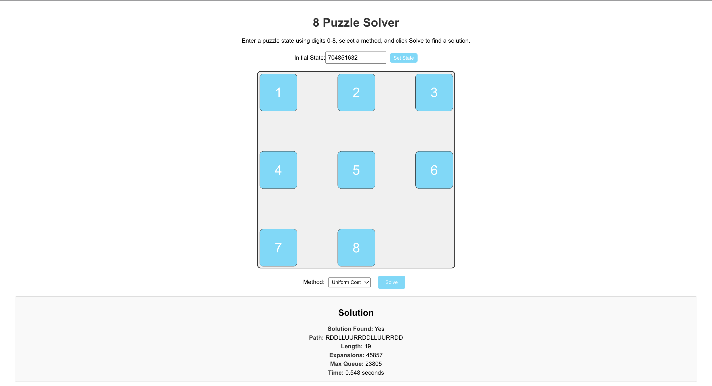

# 8-Puzzle Solver

A web-based solver for the 8-puzzle problem, built with **React** for the front-end and **WebAssembly** (compiled from C++) for efficient puzzle-solving. It implements **Uniform Cost Search (UCS)** and **A* algorithms** with two heuristics (Misplaced Tiles and Manhattan Distance), featuring animated tile movements to visualize the solution.

## Status

This is a **work-in-progress (WIP)** initial commit. The core functionality works, but it’s not yet polished or production-ready. Expect ongoing improvements and new features in future updates.

## Features

- Solves the 8-puzzle using:
    - Uniform Cost Search (UCS)
    - A* with Misplaced Tiles heuristic
    - A* with Manhattan Distance heuristic
- Animated tile transitions in the UI using Framer Motion.
- Displays solution details: path, length, state expansions, max queue size, and runtime.

## Screenshot



## Setup

To run the project locally, follow these steps:

### Prerequisites
- [Node.js](https://nodejs.org/) (v16 or later recommended)

### Installation
1. **Clone the Repository**:
   ```bash
   git clone https://github.com/johnnycwatt/8-puzzle-solver.git
   cd 8-puzzle-solver

2. **Install Node.js Dependencies:**
   ```bash
   npm install
   
3. Run the App:
   ```bash
   npm start
   
Open your browser at http://localhost:3000 to see the solver in action.

## Usage
- Enter a 9-digit puzzle state (e.g., "208135467") using numbers 0-8, where 0 represents the blank tile.
- Select a method (UCS or A*) and, if A*, choose a heuristic.
- Click "Solve" to see the solution path, stats, and animated tile movements.

## To-Do
- Add validation for puzzle solvability (e.g., inversion count check).
- Enhance UI with better error messages and styling.
- Improve documentation (setup, code structure, contributing guide).
- Optimize solver performance for deeper searches.
