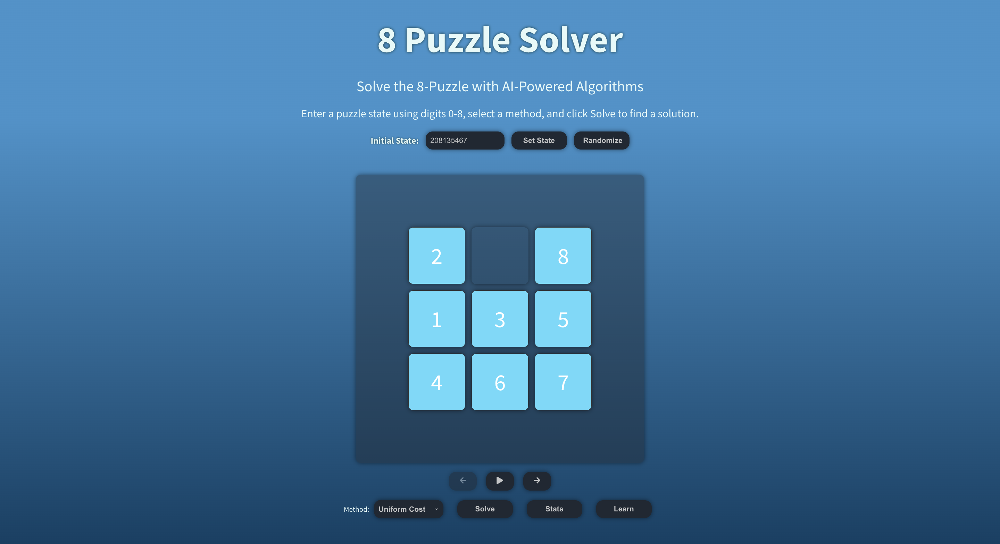
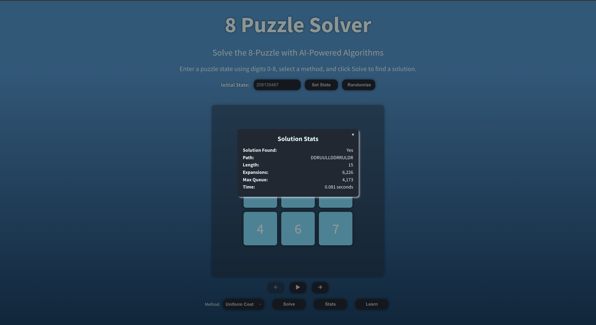
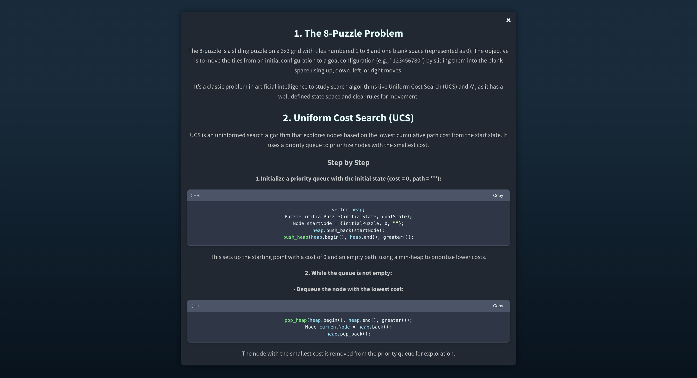

# 8-Puzzle Solver



The 8-Puzzle Solver is an interactive web application that allows users to explore and solve the classic 8-puzzle problem using two search algorithms: Uniform Cost Search (UCS) and A* Search. The app provides a visual interface to interact with the puzzle, view solving statistics, and learn about the underlying algorithms in detail.

**Live Demo**: [https://eight-puzzle-solver-one.vercel.app/](https://eight-puzzle-solver-one.vercel.app/)

## Overview

The 8-puzzle is a sliding puzzle on a 3x3 grid with tiles numbered 1 to 8 and one blank space (represented as 0). The goal is to rearrange the tiles from a given initial configuration to a target configuration (e.g., "123456780") by sliding them into the blank space using up, down, left, or right moves. This app implements two search algorithms to solve the puzzle:

- **Uniform Cost Search (UCS)**: An uninformed search algorithm that explores nodes based on the lowest cumulative path cost.
- **A* Search**: An informed search algorithm that uses heuristics (Misplaced Tiles or Manhattan Distance) to guide the search efficiently.

The app also includes educational content to help users understand how these algorithms work, along with detailed statistics about the solving process.


## Features

- **Interactive Puzzle Grid**: Drag and drop tiles to create a custom initial configuration or use a pre-set puzzle.
- **Algorithm Selection**: Choose between UCS and A* Search to solve the puzzle. For A*, select between two heuristics: Misplaced Tiles or Manhattan Distance.
- **Solving Visualization**: Watch the puzzle being solved step-by-step with animations showing each move.
- **Statistics Modal**: View detailed statistics after solving, including:
    - Path length (number of moves to the solution).
    - Number of state expansions.
    - Maximum queue length during the search.
    - Running time of the algorithm.
- **Learn Modal**: Explore an in-depth explanation of the 8-puzzle problem, UCS, A* Search, and the heuristics used, complete with code snippets and complexity analysis.
- **Responsive Design**: Works seamlessly on both desktop and mobile devices.


## Usage

1. **Access the App**: Visit [https://eight-puzzle-solver-one.vercel.app/](https://eight-puzzle-solver-one.vercel.app/).
2. **Set Up the Puzzle**:
    - Use the default puzzle configuration or drag tiles to create a custom starting state.
3. **Choose an Algorithm**:
    - Select either UCS or A* Search from the solver panel.
    - If using A*, choose a heuristic (Misplaced Tiles or Manhattan Distance).
4. **Solve the Puzzle**:
    - Click the "Solve" button to start the solving process.
    - Watch the puzzle animate as the algorithm finds the solution.
5. **View Statistics**:
    - After solving, click the "Stats" button to see detailed metrics about the solving process.
6. **Learn More**:
    - Click the "Learn" button to open a modal with educational content about the 8-puzzle problem, UCS, A* Search, and heuristics.

## Screenshots

### App Interface
The main interface where users can interact with the puzzle grid and select solving options.


### Stats Modal
Displays detailed statistics about the solving process, such as path length and running time.



### Learn Modal
Provides an in-depth explanation of the 8-puzzle problem, algorithms, and heuristics, with code snippets.




## Technologies Used

- **React**: Front-end framework for building the user interface.
- **Styled-Components**: For styling components with CSS-in-JS.
- **WebAssembly (Wasm)**: Compiled from C++ code to perform efficient puzzle-solving computations.
- **Vercel**: Hosting platform for deploying the static app.
- **GitHub**: Version control and repository hosting.

## Setup

### Prerequisites
- [Node.js](https://nodejs.org/) (v16 or later recommended)

### Installation
1. **Clone the Repository**:
   ```bash
   git clone https://github.com/johnnycwatt/8-puzzle-solver.git
   cd 8-puzzle-solver

2. **Install Node.js Dependencies:**
   ```bash
   npm install
   
3. Run the App:
   ```bash
   npm start
   
Open your browser at http://localhost:3000 to see the solver in action.

## License
This project is licensed under the Apache License 2.0. See the [LICENSE](LICENSE) file for details.

## Contact
For questions, feedback, or issues, please reach out:

- **Email**: [johnnycwatt@gmail.com](mailto:johnnycwatt@gmail.com)
- **GitHub**: [Johnny's GitHub](https://github.com/johnnycwatt)